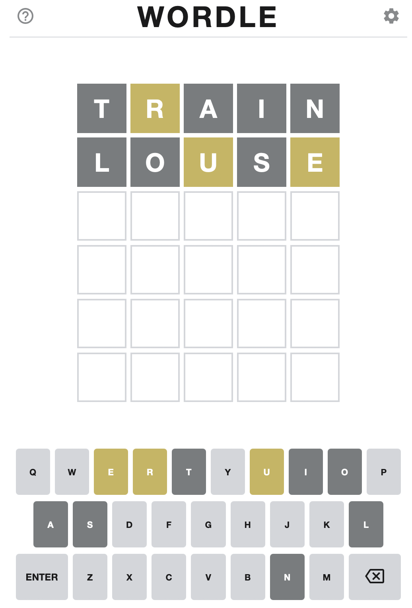

wordlebrain: wordle helper tool
===============================

Wordlebrain is a tool to help you find good guesses for the wordle
word guessing game.  https://www.powerlanguage.co.uk/wordle/. 
You tell wordlebrain what you guessed, and what hints Wordle 
gave you back, it will suggest words that satisfy the hints.
As you tell it more guesses and hints, it adds them to what it 
knows and narrows down the list of suggestions

---


---


Input your guesses like this,

```
wordlebrain> guess TRAIN nynnn
wordlebrain> guess LOUSE nnyny
```

Where:
* `n` means letter not in word, 
* `y` means letter in word somewhere, 
* `Y` means letter in in word at this spot.  

Wordlebrain will give a list of suggested guesses like this: 

```
wordlebrain> guess louse nnyny
6457 CURED
6394 PURED
6228 MURED
5475 MUREX
5444 CUBER
5438 PUCER
5318 PUKER
5309 BUYER
5296 FUMER
5236 DUPER
...and 21 more.
```

To start a new game, or start over, type `reset`.

To quit, type `quit` or `exit`

Commands
--------
* `guess <word> <hint>` -- give a guess and the resulting hints, e.g. "guess TRAIN nyynY".
* `reset`               -- reset the game state to start over
* `exit` or `quit`        -- quit the progam
* `show [N]`            -- show [up to N] suggestions
* `showstate`           -- show wordlebrain's internal state 
                          (for curious geeks)


Installation
------------

1. Clone this repo
2. pip install wordlebrain
3. `$ wordlebrain`


Example Game
------------

The word is `HERON`

```
wordlebrain> guess louse nynny
7036 PAREO
6873 OARED
6412 CAMEO
6141 OATER
5998 OATEN
5947 OAKED
5797 OAKER
5654 OAKEN
5569 PEONY
5539 VIREO
...and 153 more.
wordlebrain> guess cameo nnnyy
5569 PEONY
4962 GEOID
4806 TEPOY
4778 TENOR
4619 DEOXY
4543 HERON
4526 PEROG
4381 BETON
4326 BEGOT
4294 PEEOY
...and 51 more.
wordlebrain> guess peony nYyyn
4778 TENOR
4543 HERON
4381 BETON
3874 REDON
3781 DEVON
3755 REWON
3708 TENON
3674 JETON
3530 REJON
3068 XENON
wordlebrain> guess tenor nYyYy
4543 HERON
3874 REDON
3755 REWON
3530 REJON
```


How it works
------------

Wordlebrain has a list of five letter words it uses to start.  Each guess's hints create three kinds of contraints: a five-letter matching pattern, a list of required letters, and a list of excluded letters.  With each new guess, wordlebrain merges the new constraints with the existing constraints, applies all the constraints to the word list, and produces a new set of suggestions.

### What are those numbers?

Rather than present the suggestions in alphabetical order, wordlebrain gives each word a score designed such that higher scoring words should provide more constraint on the remaining words if applied as the next guess.  The score is a the sum of the positional letter frequency of each letter, with a penalty for repeated letters.

**Note**: the highest scoring suggestion is not necessarily the *best* suggestion.  You will still have to use your judgement to choose a good guess at each step, unless wordlebrain has narrowed your choices down to one word. (It happens!)

### See the brain's state

If you're curious, at any point you can look at the internal state of wordlebrain with the command `showstate`.  Here is the state from the end of the game above (`HERON`):

```
wordlebrain> showstate
== PATTERNS ==
re.compile('.[^O]..[^E]')
re.compile('...[^E][^O]')
re.compile('.E[^O][^N].')
re.compile('.E[^N]O[^R]')

EXCLUDE: {'U', 'C', 'T', 'L', 'Y', 'S', 'A', 'M', 'P'}
REQUIRE: {'O', 'N', 'R', 'E'}
```

To be shown as a suggestion, words must
* match all the patterns exactly,
* include all the required letters, and
* not include any excluded letters.


Guessing Strategy
-----------------

__First Guess__: There are many strategies for choosing opening words for Wordle. However, you're using `wordlebrain`, I recommend guessing `CARES` as the first guess.  By Wordlebrain's scoring formula that is the highest scoring word in the word bank, and by experience it seems to eliminate the largest number of options.   Several other first guess options also work well: 'ADIEU' (vowels), 'CARET', 'RAISE', 'TRAIN', however my experience has been that `CARES` is the most consistent word for reducing the initial word set.

__Second Guess and Later__:  My strategy for the second guess is to use the top recommended word, unless it seems like a less common word _and_ there is a high-scoring common word visible in the top 10 possibilities displayed.  Remember that while there are around 12,000 guessable words, only about 2,500 of those are eligible to be answers.  Strange words like `SLOPY` and `SOILY` are probably not answers.  If I get a list with `SOILY` at the top and `STONY` close behind, I might choose `STONY` instead in the hope that it might be the answer.  This strategy applies even more strongly after several guesses when the word list is small.  For example, if I get this list of possibilities,
```
140 STILB
140 SPILT
128 STILL
124 SPILL
120 SWILL
120 SKILL
120 SHILL
116 STILT
```
I'd much rather choose any other word in the list than `STILB`.
